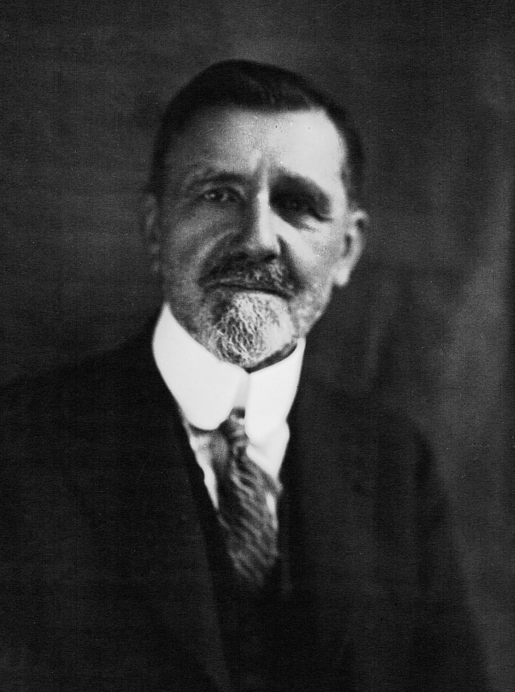

---
## Front matter
lang: ru-RU
title: Игра полковника Блотто
author:
  - Абакумова О. М., НФИбд-02-22
institute:
  - Российский университет дружбы народов, Москва, Россия


## i18n babel
babel-lang: russian
babel-otherlangs: english

## Formatting pdf
toc: false
toc-title: Содержание
slide_level: 2
aspectratio: 169
section-titles: true
theme: metropolis
header-includes:
 - \metroset{progressbar=frametitle,sectionpage=progressbar,numbering=fraction}
mainfont: Open Sans Light
---

# Информация

## Докладчик

:::::::::::::: {.columns align=center}
::: {.column width="70%"}

  * Абакумова Олеся Максимовна
  * Студентка
  * Российский университет дружбы народов
  * 1132220832@pfur.ru
  * <https://github.com/omabakumova>

:::
::: {.column width="30%"}


:::
::::::::::::::

# Цель работы

Изучить правила основные стратегии игры полковника Блотто.

# Задачи

1. Объяснить правила и основные принципы игры "Полковник Блотто";

2. Рассмотреть оптимальные стратегии для станадартных случаев;

3. Реализовать программу на языке Julia для примеров;

4. Рассмотреть схематичное описание пространства состояний и оптимальных стратегий для игры полковника Блотто с двумя полями боя (B=2) и асимметричными ресурсами (B > E);

5. Реализовать программу на языке Julia для описания игры полковника Блотта с двумя полями боя и ассиметричными ресурсами.

# Актуальность

Применение:

- Теория игр, экономика, военная стратегия, политология, машинное обучение.

Почему важно?

- Модель распределения ограниченных ресурсов для максимизации преимущества.

- Демонстрирует конкурентную борьбу и важность предсказания действий оппонента.

- Используется в ИИ (игровые боты, системы принятия решений).

# Игры Блотто

## Игры Блотто

Стратегическое распределение ресурсов в условиях конфликта.
Суть игры:

- Два игрока распределяют ограниченные ресурсы по "полям битв"

- Победа на поле: у кого больше ресурсов

- Общий выигрыш = сумма выигранных полей

{#fig:001 width=25%}

## Игры Блотто

Ключевые особенности:

- Классическая игра с нулевой суммой

- Детерминированные правила победы

- Неполная информация о действиях противника

## Игры Блотто

Историческая справка:

- Предложена Борелем (1921)

- Развита в работах Гросса, Вагнера, Робертсона

{#fig:002 width=20%}

# Пример игры Блотто

## Пример игры Блотто

Правила игры:

- 2 игрока выбирают **3 числа** (в порядке неубывания), сумма = **S**  
- Побеждает тот, у кого **2 из 3 чисел** больше, чем у соперника  

Пример для S = 6:

| Варианты       | (1,1,4) | (1,2,3) | (2,2,2) |  
|---------------|---------|---------|---------|  
| **(1,1,4)**   | Ничья   | Ничья   | Проигрыш|  
| **(1,2,3)**   | Ничья   | Ничья   | Ничья   |  
| **(2,2,2)**   | **Победа** | Ничья   | Ничья   |  

**Оптимальная стратегия:** (2,2,2) — не проигрывает, иногда выигрывает.  

## Пример игры Блотто

Обобщение для разных S:

- **S = 12** $\rightarrow$ (2,4,6)  
- **S > 12** $\rightarrow$ Нужны **рандомизированные** стратегии (например, для S=13: смесь (3,5,5), (3,3,7), (1,5,7))   

# Программная реализация примера на языке Julia

## Программная реализация примера на языке Julia

```Julia
struct ColonelBlottoGame
    battlefields::Int
    soldiers::Int
    strategies::Vector{Vector{Int}}
    payoff_matrix::Dict{Tuple{Int,Int},Int}
end
```
## Программная реализация примера на языке Julia

```Julia
function generate_all_strategies(battlefields::Int, soldiers::Int)
    parts = partitions(soldiers, battlefields)
    strategies = Set{Vector{Int}}()
    for p in parts
        s = sort(vcat(p, zeros(Int, battlefields - length(p)), rev=true)
        push!(strategies, s)
    end
    return sort(collect(strategies), lt=(x,y) -> isless(x,y))
end
```

## Программная реализация примера на языке Julia

```Julia
function calculate_payoff(strategy1::Vector{Int}, strategy2::Vector{Int})
    wins = 0
    for (s1, s2) in zip(strategy1, strategy2)
        wins += sign(s1 - s2)  # Comparison for each field
    end
    return wins
end
```


## Программная реализация примера на языке Julia

В качестве вывода для анализа получаем:

1. Оптимальная стратегия для S=6

```Julia
Nash equilibrium strategy for (3 fields, 6 soldiers):
Special case for 3 fields and 6 soldiers: pure strategy [2, 2, 2]
Strategy [2, 2, 2]: probability 1.0
```
Для 6 солдат существует единственная оптимальная стратегия --- равномерное распределение [2,2,2]. Она гарантирует невозможность проигрыша.

## Программная реализация примера на языке Julia

2. Победа оптимальной стратегии

```Julia
Your strategy: [2, 2, 2]
Computer’s strategy: [4, 1, 1]
Results: You won 2 fields, the computer won 1 field.
You won!
```
Даже при меньшем максимальном числе (2 против 4), равномерное распределение побеждает за счет контроля большинства полей (2 из 3).

## Программная реализация примера на языке Julia

3. Смешанные стратегии для S=12

```Julia
Strategy [6, 4, 2]: probability 0.33  
Strategy [7, 3, 2]: probability 0.33  
Strategy [5, 5, 2]: probability 0.33  
```
Для 12 солдат оптимальной становится смешанная стратегия --- случайный выбор между тремя вариантами. Чистых решений больше нет.

## Программная реализация примера на языке Julia

4. Пример ничьи для S=12

```Julia
Your strategy: [5, 5, 2]  
Computer's strategy: [6, 4, 2]  
Results: you won 1 battlefield, computer won 1 battlefield  
Draw!
```
При больших S исход становится вероятностным. Даже хорошая стратегия может привести к ничье, что характерно для сложных игр.

## Программная реализация примера на языке Julia

Сравнение стратегий:

| Параметры      | S=6               | S=12                     |  
|----------------|-------------------|--------------------------|  
| **Тип равновесия** | Чистая стратегия  | Смешанная стратегия      |  
| **Пример**      | `[2,2,2]`         | `[6,4,2]`, `[5,5,2]`, ...|  
| **Результат**   | Всегда победа/ничья | Ничья/победа с вероятностью |  

## Программная реализация примера на языке Julia

Определение равновесия Нэша.
**Ключевая идея:**  
Профиль стратегий, где **ни один игрок не может улучшить свой выигрыш**, меняя свою стратегию, если остальные сохраняют свои.  
**Формула:**  
Для всех игроков $i$:  
$$
H_i(x^*) \geq H_i(x_i, x_{-i}^*),
$$  
где $x^*$ — текущая стратегия, $x_i$ — любая альтернатива. 

# Игра полковника Блотто с двумя полями боя и асимметричными ресурсами

## Игра полковника Блотто с двумя полями боя (B=2) и асимметричными ресурсами (B > E)

**Ключевое исследование**:  
- Macdonell и Mastronardi (2015) дали **полное описание равновесий Нэша** для базовой версии игры "Полковник Блотто" с двумя полями боя.  
Их работа включает:  
- Графический алгоритм для нахождения равновесных стратегий.  
- Выявление новых равновесий Нэша.  
- Определение нерациональных действий. 

## Игра полковника Блотто с двумя полями боя (B=2) и асимметричными ресурсами (B > E)   

**Условия игры**:  
- Два игрока (Блотто и Противник), **два поля равной ценности**.  
- Полковник Блотто имеет больше ресурсов (норма ≈1), Противник — меньше (<1).  
- **Равновесие Нэша** зависит от соотношения ресурсов.  
   
## Игра полковника Блотто с двумя полями боя (B=2) и асимметричными ресурсами (B > E)   

{#fig:003 width=60%}

## Реализация программы на языке Julia для описания игры полковника Блотта с двумя полями боя и ассиметричными ресурсами.

Реализуем программу опираясь на приведенную выше схему игры полковника Блотто (асимметричные ресурсы, 2 поля боя, равновесия Нэша по регионам), для этого необходимо объединить:

1. Генерацию стратегий для обоих игроков (Blotto и Enemy).

2. Расчёт выигрышей на основе таблицы регионов.

3. Поиск оптимальных стратегий через линейное программирование (LP).

## Реализация программы на языке Julia для описания игры полковника Блотта с двумя полями боя и ассиметричными ресурсами.

```Julia
struct ColonelBlottoGame
    battlefields::Int
    soldiers_blotto::Int
    soldiers_enemy::Int
    strategies_blotto::Vector{Vector{Int}}
    strategies_enemy::Vector{Vector{Int}}
end
```

- Хранит параметры игры.

## Реализация программы на языке Julia для описания игры полковника Блотта с двумя полями боя и ассиметричными ресурсами.

```Julia
function generate_all_strategies(battlefields::Int, soldiers::Int)
    parts = partitions(soldiers, battlefields)
    strategies = Set{Vector{Int}}()
    for p in parts
        s = sort(vcat(p, zeros(Int, battlefields - length(p))), rev=true)  
        push!(strategies, s)
    end
    return sort(collect(strategies), lt=(x,y) -> isless(x,y))
end
```
- Генерирует все возможные распределения солдат по полям боя (например, [4,2], [3,3] для 6 солдат).

## Реализация программы на языке Julia для описания игры полковника Блотта с двумя полями боя и ассиметричными ресурсами.

```Julia
function find_nash_equilibrium(game::ColonelBlottoGame)
    model = Model(GLPK.Optimizer)
    @variable(model, x[1:nB] >= 0)  # Blotto strategy probabilities
    @variable(model, v)             # Minimum guaranteed payoff
    @constraint(model, sum(x) == 1)
    # Constraints: Blotto's payoff ≥ v against any Enemy strategy
    @objective(model, Max, v)
    optimize!(model)
    return Dict(i => x_val[i] for i in 1:nB if x_val[i] > 0)
end
```
- Решает задачу линейного программирования для нахождения оптимальных смешанных стратегий.

## Реализация программы на языке Julia для описания игры полковника Блотта с двумя полями боя и ассиметричными ресурсами.

```Julia
Resources: Blotto=6, Enemy=3
Blotto strategies: [[3, 3], [4, 2], [5, 1]]
Enemy strategies: [[2, 1]]
Optimal Blotto strategy: Dict(1 => 1.0)
Blotto chose: [3, 3]
Enemy chose: [2, 1]
Payoff: Blotto=2, Enemy=0
```

# Выводы

Были изучены правила и основные стратегии игры полковника Блотто.

# Список литературы

1. The Wisdom of Crowds [Электронный ресурс]. URL: https://en.wikipedia.org
/wiki/Blotto_game.
2. The Wisdom of Crowds [Электронный ресурс]. URL: https://en.wikipedia.org
/wiki/%C3%89mile_Borel.
3. The Wisdom of Crowds [Электронный ресурс]. URL: https://en.wikipedia.org
/wiki/Nash_equilibrium.
4. Waging Simple Wars [Электронный ресурс]. URL: https://scott-macdonell.co
m/wp-content/uploads/2014/04/wagingsimplewars.pdf.


