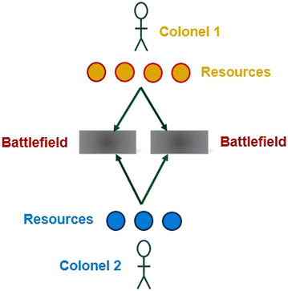
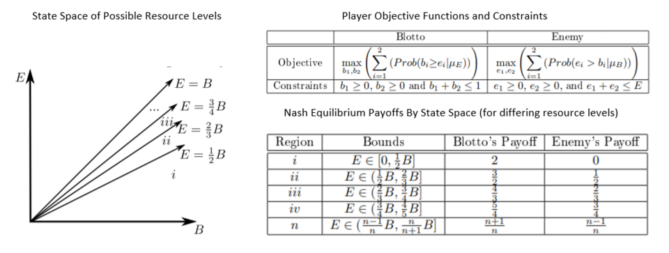

---
## Front matter
title: "Доклад"
subtitle: "Игра полковника Блотто"
author: "Абакумова Олеся Максимовна, НФИбд-02-22"

## Generic otions
lang: ru-RU
toc-title: "Содержание"

## Bibliography
bibliography: bib/cite.bib
csl: pandoc/csl/gost-r-7-0-5-2008-numeric.csl

## Pdf output format
toc: true # Table of contents
toc-depth: 2
lof: true # List of figures
lot: true # List of tables
fontsize: 12pt
linestretch: 1.5
papersize: a4
documentclass: scrreprt
## I18n polyglossia
polyglossia-lang:
  name: russian
  options:
	- spelling=modern
	- babelshorthands=true
polyglossia-otherlangs:
  name: english
## I18n babel
babel-lang: russian
babel-otherlangs: english
## Fonts
mainfont: IBM Plex Serif
romanfont: IBM Plex Serif
sansfont: IBM Plex Sans
monofont: IBM Plex Mono
mathfont: STIX Two Math
mainfontoptions: Ligatures=Common,Ligatures=TeX,Scale=0.94
romanfontoptions: Ligatures=Common,Ligatures=TeX,Scale=0.94
sansfontoptions: Ligatures=Common,Ligatures=TeX,Scale=MatchLowercase,Scale=0.94
monofontoptions: Scale=MatchLowercase,Scale=0.94,FakeStretch=0.9
mathfontoptions:
## Biblatex
biblatex: true
biblio-style: "gost-numeric"
biblatexoptions:
  - parentracker=true
  - backend=biber
  - hyperref=auto
  - language=auto
  - autolang=other*
  - citestyle=gost-numeric
## Pandoc-crossref LaTeX customization
figureTitle: "Рис."
tableTitle: "Таблица"
listingTitle: "Листинг"
lofTitle: "Список иллюстраций"
lotTitle: "Список таблиц"
lolTitle: "Листинги"
## Misc options
indent: true
header-includes:
  - \usepackage{indentfirst}
  - \usepackage{float} # keep figures where there are in the text
  - \floatplacement{figure}{H} # keep figures where there are in the text
---

# Цель работы

Изучить правила основные стратегии игры полковника Блотто.

# Задачи

1. Объяснить правила и основные принципы игры "Полковник Блотто";

2. Рассмотреть оптимальные стратегии для станадартных случаев;

3. Реализовать программу на языке Julia для примеров;

4. Рассмотреть схематичное описание пространства состояний и оптимальных стратегий для игры полковника Блотто с двумя полями боя (B=2) и асимметричными ресурсами (B > E);

5. Реализовать программу на языке Julia для описания игры полковника Блотта с двумя полями боя и ассиметричными ресурсами.

# Актуальность

Игра полковника Блотто представляет собой классическую модель стратегического взаимодействия, которая находит применение не только в теории игр, но и в экономике, военном деле, политологии и даже машинном обучении.
Почему эта тема важна?

- Игра демонстрирует, как ограниченные ресурсы можно распределять для достижения максимального преимущества, что актуально в бизнесе, управлении и планировании.

- Она помогает понять принципы конкурентной борьбы, где важно не только собственное решение, но и предсказание действий оппонента.

- Моделирование таких стратегий полезно в алгоритмах искусственного интеллекта, например, в разработке игровых ботов или систем принятия решений.
Таким образом, изучение «Полковника Блотто» позволяет развивать стратегическое мышление и находить неочевидные решения в условиях конфликта интересов.

# Игры Блотто

Игры Блотто (Игры Полковника Блотто) [@Blotto_game] представляют собой класс игр двух лиц с нулевой суммой, в которой задача игроков состоит в распределении ограниченных ресурсов по нескольким объектам (полям битв). В классической версии игры игрок, выставивший больше ресурсов на поле, выигрывает битву на этом поле, а суммарный выигрыш (цена игры) равен сумме выигранных битв (рис. [-@fig:001]):

{#fig:001 width=70%}

Модель Блотто (также известная как "Игра Полковника Блотто") относится к классу антагонистических игр, в которых участники распределяют заданный объём ресурсов между несколькими стратегическими объектами (например, участками фронта). Победа на каждом отдельном направлении определяется превосходством в количестве выделенных сил, а общий успех зависит от совокупности выигранных позиций.
Несмотря на то, что математическая постановка данной задачи была предложена ещё в первой половине XX века (Борель, 1921) (рис. [-@fig:002]), системное изучение её модификаций продолжалось вплоть до конца столетия. Значительный вклад в развитие теории внесли работы Робертсона (2006), где были строго формализованы условия равновесия для произвольных конфигураций игры [@Borel].

{#fig:002 width=70%}

Особый интерес представляет исторический контекст возникновения данной модели. В середине прошлого века Гросс и Вагнер использовали образ условного военачальника, решающего задачу оптимального размещения ограниченного контингента войск на нескольких театрах военных действий. Ключевыми особенностями данной постановки являются:

- Детерминированный характер победы на каждом направлении (побеждает сторона с большим количеством сил);

- Отсутствие у игроков информации о распределении ресурсов противником;

- Целевая функция, направленная на максимизацию числа выигранных позиций.

## Пример игры Блотто

Рассмотрим игру, где два игрока выбирают по три целых положительных числа в порядке неубывания, сумма которых равна заданному числу S. Затем игроки сравнивают свои наборы: побеждает тот, у кого два числа из трёх окажутся больше, чем у соперника.
Для S = 6 возможны три варианта:

- (2, 2, 2)

- (1, 2, 3)

- (1, 1, 4)

Анализ исходов:

- Любой набор против себя — ничья.

- (1, 1, 4) против (1, 2, 3) — ничья.

- (1, 2, 3) против (2, 2, 2) — ничья.

- (2, 2, 2) побеждает (1, 1, 4).
Оптимальная стратегия — (2, 2, 2), так как она не проигрывает другим вариантам, а против (1, 1, 4) даёт победу. В этой игре есть несколько равновесий Нэша: если оба игрока выбирают (2, 2, 2) или (1, 2, 3), ни один не может улучшить свой результат, меняя стратегию.
Для больших S:

- При S = 12 оптимально (2, 4, 6).

- При S > 12 чисто детерминированные стратегии перестают быть оптимальными. Например, для S = 13 лучший вариант — случайный выбор между (3, 5, 5), (3, 3, 7) и (1, 5, 7) с вероятностью 1/3 для каждого.

Игра Бореля --- это аналогичная модель, но с непрерывным выбором чисел (не только целых), что делает множество стратегий бесконечным.

Исторический аналог:
В древнем Китае стратег Сунь Бинь (эпизод «Скачки Тянь Цзи») предложил похожую тактику в гонках колесниц. У каждой стороны было три команды: быстрые (3), средние (2) и медленные (1). Изначально Тянь Цзи выставлял их в порядке 1, 2, 3, но Сунь Бинь посоветовал схему 2, 3, 1:

- Его «2» побеждала «1» соперника;

- Его «3» побеждала «2»;

- Его «1» проигрывала «3».

В итоге — две победы против одной, что принесло общий выигрыш.

**Ключевая идея:**
Распределение ресурсов и тактическое превосходство важнее абсолютной силы.

## Программная реализация примера 

Рассмотрим теперь вариант программной реализации примера игры полковника Блотто предложенного выше:

```Julia

using Combinatorics
using Random
using StatsBase
using LinearAlgebra
using DataStructures

# Структура для представления игры "Полковник Блотто"
struct ColonelBlottoGame
    battlefields::Int  # Количество полей сражений
    soldiers::Int      # Общее количество солдат
    strategies::Vector{Vector{Int}}  # Все возможные стратегии
    payoff_matrix::Dict{Tuple{Int,Int},Int}  # Матрица выигрышей
end

# Конструктор игры
function ColonelBlottoGame(battlefields::Int=3, soldiers::Int=6)
    strategies = generate_all_strategies(battlefields, soldiers)
    payoff_matrix = build_payoff_matrix(strategies)
    ColonelBlottoGame(battlefields, soldiers, strategies, payoff_matrix)
end

# Генерация всех возможных стратегий
function generate_all_strategies(battlefields::Int, soldiers::Int)
    # Генерация всех возможных распределений солдат по полям сражений
    parts = partitions(soldiers, battlefields)
    strategies = Set{Vector{Int}}()
    
    for p in parts
        # Добавление нулей при необходимости и сортировка
        s = sort(vcat(p, zeros(Int, battlefields - length(p))), rev=true)
        push!(strategies, s)
    end
    
    # Преобразование в отсортированный вектор векторов
    return sort(collect(strategies), lt=(x,y) -> isless(x,y))
end

# Расчет выигрыша для пары стратегий
function calculate_payoff(strategy1::Vector{Int}, strategy2::Vector{Int})
    wins = 0
    for (s1, s2) in zip(strategy1, strategy2)
        if s1 > s2
            wins += 1
        elseif s1 < s2
            wins -= 1
        end
    end
    return wins
end

# Построение матрицы выигрышей
function build_payoff_matrix(strategies::Vector{Vector{Int}})
    payoff_matrix = Dict{Tuple{Int,Int},Int}()
    n = length(strategies)
    
    for i in 1:n, j in 1:n
        payoff = calculate_payoff(strategies[i], strategies[j])
        payoff_matrix[(i,j)] = payoff
    end
    
    return payoff_matrix
end

# Поиск равновесия Нэша
function find_nash_equilibrium(game::ColonelBlottoGame)
    if game.battlefields == 3 && game.soldiers == 6
        # Специальный случай из Википедии - чистая стратегия (2,2,2)
        println("Используется специальный случай для 3 полей и 6 солдат: чистая стратегия [2,2,2]")
        optimal_strategy = Dict(3 => 1.0)  # Предполагаем, что (2,2,2) - это 3-я стратегия
        return optimal_strategy
    elseif game.battlefields == 3 && game.soldiers == 12
        # Поиск индексов оптимальных стратегий
        println("Используется специальный случай для 3 полей и 12 солдат: смешанная стратегия")
        strategy_indices = []
        for (i, s) in enumerate(game.strategies)
            if s == [6,4,2] || s == [5,5,2] || s == [7,3,2] || s == [7,5,0]
                push!(strategy_indices, i)
            end
        end
        
        # Равномерное распределение
        prob = 1.0 / length(strategy_indices)
        optimal_strategy = Dict(i => prob for i in strategy_indices)
        return optimal_strategy
    else
        # Общий случай - равномерное распределение
        println("Используется общий случай: равномерное распределение по всем стратегиям")
        prob = 1.0 / length(game.strategies)
        return Dict(i => prob for i in 1:length(game.strategies))
    end
end

# Игра против компьютера
function play_game(game::ColonelBlottoGame; human_strategy=nothing)
    println("\nИгра Полковник Блотто ($(game.battlefields) поля, $(game.soldiers) солдат)")
    println("Возможные стратегии:")
    for (i, s) in enumerate(game.strategies)
        println("$i: $s")
    end
    
    # Компьютер выбирает стратегию согласно равновесию Нэша
    ne_strategy = find_nash_equilibrium(game)
    computer_choice = sample(collect(keys(ne_strategy)), Weights(collect(values(ne_strategy))))
    computer_strategy = game.strategies[computer_choice]
    
    if human_strategy === nothing
        # Человек выбирает стратегию
        println("\nВыберите вашу стратегию (введите номер):")
        human_choice = parse(Int, readline())
        human_strategy = game.strategies[human_choice]
    else
        # Используется предоставленная стратегия
        human_strategy = sort(human_strategy, rev=true)
        human_choice = findfirst(==(human_strategy), game.strategies)
    end
    
    println("\nВаша стратегия: $(human_strategy)")
    println("Стратегия компьютера: $(computer_strategy)")
    
    # Определение победителя
    human_wins = 0
    computer_wins = 0
    for (h, c) in zip(human_strategy, computer_strategy)
        if h > c
            human_wins += 1
        elseif c > h
            computer_wins += 1
        end
    end
    
    println("\nРезультаты: вы выиграли $human_wins полей, компьютер выиграл $computer_wins полей")
    
    if human_wins > computer_wins
        println("Вы победили!")
    elseif computer_wins > human_wins
        println("Компьютер победил!")
    else
        println("Ничья!")
    end
    
    return human_wins - computer_wins
end

# Пример использования
println("=== Игра Полковник Блотто ===")
println("Тестирование известных случаев равновесия Нэша...")

# Тестовый случай из Википедии с 3 полями и 6 солдатами
game1 = ColonelBlottoGame(3, 6)
println("\nСтратегия равновесия Нэша для (3 поля, 6 солдат):")
ne = find_nash_equilibrium(game1)
for (k, v) in ne
    println("Стратегия $(game1.strategies[k]): вероятность $(round(v, digits=2))")
end

# Игра с оптимальной стратегией (2,2,2)
println("\nИгра с оптимальной стратегией [2,2,2]:")
play_game(game1, human_strategy=[2,2,2])

# Тестовый случай с 3 полями и 12 солдатами
game2 = ColonelBlottoGame(3, 12)
println("\nСтратегия равновесия Нэша для (3 поля, 12 солдат):")
ne = find_nash_equilibrium(game2)
for (k, v) in ne
    if v > 0
        println("Стратегия $(game2.strategies[k]): вероятность $(round(v, digits=2))")
    end
end

# Игра со случайной стратегией
println("\nИгра со случайной стратегией:")
play_game(game2)

```
В результате получаем:
```

=== Игра Полковник Блотто ===
Тестирование известных случаев равновесия Нэша...

Стратегия равновесия Нэша для (3 поля, 6 солдат):
Используется специальный случай для 3 полей и 6 солдат: чистая стратегия [2,2,2]
Стратегия [4, 1, 1]: вероятность 1.0

Игра с оптимальной стратегией [2,2,2]:

Игра Полковник Блотто (3 поля, 6 солдат)
Возможные стратегии:
1: [2, 2, 2]
2: [3, 2, 1]
3: [4, 1, 1]
Используется специальный случай для 3 полей и 6 солдат: чистая стратегия [2,2,2]

Ваша стратегия: [2, 2, 2]
Стратегия компьютера: [4, 1, 1]

Результаты: вы выиграли 2 полей, компьютер выиграл 1 полей
Вы победили!

Стратегия равновесия Нэша для (3 поля, 12 солдат):
Используется специальный случай для 3 полей и 12 солдат: смешанная стратегия
Стратегия [6, 4, 2]: вероятность 0.33
Стратегия [7, 3, 2]: вероятность 0.33
Стратегия [5, 5, 2]: вероятность 0.33

Игра со случайной стратегией:

Игра Полковник Блотто (3 поля, 12 солдат)
Возможные стратегии:
1: [4, 4, 4]
2: [5, 4, 3]
3: [5, 5, 2]
4: [6, 3, 3]
5: [6, 4, 2]
6: [6, 5, 1]
7: [7, 3, 2]
8: [7, 4, 1]
9: [8, 2, 2]
10: [8, 3, 1]
11: [9, 2, 1]
12: [10, 1, 1]
Используется специальный случай для 3 полей и 12 солдат: смешанная стратегия

Выберите вашу стратегию (введите номер):
stdin>  3

Ваша стратегия: [5, 5, 2]
Стратегия компьютера: [6, 4, 2]

Результаты: вы выиграли 1 полей, компьютер выиграл 1 полей
Ничья!
0

```
В данном случае программа:

1. Создает все возможные стратегии распределения солдат (например, для 6 солдат и 3 полей это [2,2,2], [1,2,3] и [1,1,4]).

2. Для каждой возможной пары стратегий вычисляет, кто выиграет в гипотетическом сражении.

3. Находит оптимальную стратегию (равновесие Нэша):

- Для 6 солдат - всегда выбирает [2,2,2];

- Для 12 солдат - случайно выбирает одну из 4 сильных стратегий;

- В остальных случаях - выбирает случайную стратегию.


4. Позволяет сыграть против компьютера:

- Компьютер выбирает стратегию по оптимальному алгоритму;

- Игрок может выбрать стратегию вручную или получить автоматическую;

- Программа определяет победителя, сравнивая распределения по каждому полю.

Важно пояснить, что в 3 пункте реализации программы отмечено равновесие Нэша [@Nash].

Равнове́сие Нэ́ша — концепция решения, одно из ключевых понятий теории игр. Так называется набор стратегий в игре для двух и более игроков, в котором ни один участник не может увеличить выигрыш, изменив свою стратегию, если другие участники своих стратегий не меняют[1]. Джон Нэш доказал существование такого равновесия в смешанных стратегиях в любой конечной игре.
Допустим, $(S, H)$ — некооперативная игра $n$ лиц в нормальной форме, где $S$ — набор чистых стратегий, а $H$ — набор выигрышей. Когда каждый игрок $i \in \{1, \ldots, n\}$ выбирает стратегию $x_i \in S$ в профиле стратегий $x = (x_1, \ldots, x_n)$, игрок $i$ получает выигрыш $H_i(x)$. Заметьте, что выигрыш зависит от всего профиля стратегий: не только от стратегии $x_i$, выбранной самим игроком $i$, но и от чужих стратегий $x_{-i}$, то есть всех стратегий $x_j$ при $j \neq i$.  

Профиль стратегий $x^* \in S$ является **равновесием по Нэшу**, если изменение своей стратегии $x_i^*$ на $x_i$ не выгодно ни одному игроку $i$, то есть для любого $i$  

$$
H_i(x^*) \geq H_i(x_i, x_{-i}^*).
$$  
Игра может иметь равновесие Нэша в чистых стратегиях или в смешанных (то есть при выборе чистой стратегии стохастически с фиксированной частотой). Нэш доказал, что если разрешить _смешанные стратегии_, тогда в каждой игре $n$ игроков будет хотя бы одно равновесие Нэша.

## Игра полковника Блотто с двумя полями боя (B=2) и асимметричными ресурсами (B > E)

В более простом случае с двумя полями боя Macdonell и Mastronardi (2015) [@Two_Battlefield_Blotto] первыми дали полное описание всех равновесий Нэша для базовой версии игры "Полковник Блотто". Их решение включает графический алгоритм для определения всех равновесных стратегий, а также выявляет ранее неизвестные равновесия Нэша и показывает, каких действий нельзя ожидать от рациональных игроков. В этой версии игры равновесные стратегии Нэша представляют собой набор двумерных вероятностных распределений --- распределений ресурсов между полями боя для каждого игрока. Такие стратегии также называют смешанными равновесиями Нэша (как, например, в «Камень-Ножницы-Бумага» или игре «Орлянка»).

Решение Macdonell и Mastronardi (2015), включая доказательство и графический алгоритм для нахождения равновесных стратегий, применимо и к обобщённым версиям игры. Например, когда поля боя имеют разную ценность для игроков или когда эффективность ресурсов на разных полях боя неодинакова (скажем, одно поле включает высадку с моря, и у Полковника Блотто есть морпехи вместо обычных солдат). Кроме того, их работа даёт представление о версиях игры с тремя и более полями боя.

Рассмотрим двух игроков (Полковника Блотто и Противника), два поля боя равной ценности, причём оба игрока знают общий объём ресурсов друг друга до распределения и должны одновременно принять решение о распределении. Обычно предполагается, что Полковник Блотто обладает большими ресурсами (его ресурсы можно нормировать до 1), а Противник имеет лишь часть от этих ресурсов (меньше 1). Стратегии распределения и выигрыши в равновесии Нэша зависят от соотношения ресурсов между игроками (рис. [-@fig:003]):

{#fig:003 width=80%}

Рассмотрим более детально схему:

1. Графики ресурсов

Пространство состояний разделено линиями соотношения ресурсов:

- Равные силы:  
  $E = B$
- Промежуточные случаи:
  - $E = \frac{3}{4}B$
  - $E = \frac{2}{3}B$
  - $E = \frac{1}{2}B$

Эти границы определяют регионы с разными равновесиями Нэша.

2. Формальная постановка задачи

Цели игроков:

- Blotto максимизирует вероятность $\max \sum_{i=1}^2 P(b_i \geq e_i)$;
- Enemy максимизирует вероятность $\max \sum_{i=1}^2 P(e_i > b_i)$;

Распределение ресурсов:

$$
\begin{cases}
b_1, b_2 \geq 0 \\
b_1 + b_2 \leq B \\
e_1, e_2 \geq 0 \\
e_1 + e_2 \leq E
\end{cases}
$$

3. Равновесия Нэша по регионам

Таблица показывает выигрыши в зависимости от соотношения ресурсов $E/B$:  

- **Регион $i$:** Если $E \leq \frac{1}{2}B$, Blotto гарантированно выигрывает оба поля (выигрыш $2:0$).  
- **Регион $ii$:** При $E \in (\frac{1}{2}B, \frac{2}{3}B]$ Blotto получает $\frac{3}{4}$, Enemy — $\frac{1}{2}$.  
- **Регион $n$:** Общая формула для $E \in \left(\frac{n-1}{n}B, \frac{n}{n+1}B\right)$.  


## Реализация программы на языке Julia для описания игры полковника Блотта с двумя полями боя и ассиметричными ресурсами.

Реализуем прогрмамму опираясь на приведенную выше схему игры полковника Блотто (асимметричные ресурсы, 2 поля боя, равновесия Нэша по регионам), для этого необходимо объединить:

1. Генерацию стратегий для обоих игроков (Blotto и Enemy).

2. Расчёт выигрышей на основе таблицы регионов.

3. Поиск оптимальных стратегий через линейное программирование (LP).

```Julia

using JuMP, GLPK, Combinatorics, StatsBase


struct ColonelBlottoGame
    battlefields::Int  # Для общности, но в схеме B=2
    soldiers_blotto::Int
    soldiers_enemy::Int
    strategies_blotto::Vector{Vector{Int}}
    strategies_enemy::Vector{Vector{Int}}
    # Матрица выигрышей не хранится явно
end

function ColonelBlottoGame(B::Int=2, S_blotto::Int=6, S_enemy::Int=3)
    strategies_blotto = generate_all_strategies(B, S_blotto)
    strategies_enemy = generate_all_strategies(B, S_enemy)
    ColonelBlottoGame(B, S_blotto, S_enemy, strategies_blotto, strategies_enemy)
end

function generate_all_strategies(battlefields::Int, soldiers::Int)
    parts = partitions(soldiers, battlefields)
    strategies = Set{Vector{Int}}()
    for p in parts
        s = sort(vcat(p, zeros(Int, battlefields - length(p))), rev=true)  
        push!(strategies, s)
    end
    return sort(collect(strategies), lt=(x,y) -> isless(x,y))
end

function calculate_payoff(b_strat::Vector{Int}, e_strat::Vector{Int}, B::Int, E::Int)
    ratio = E / B
    # Определяем регион по соотношению ресурсов
    if ratio ≤ 0.5
        return (2, 0)    # Регион i: Blotto выигрывает оба поля
    elseif ratio ≤ 2/3
        return (3/4, 1/2) # Регион ii
    elseif ratio ≤ 3/4
        return (3/4, 1/2) # Регион iii
    else
        return (1/2, 1/2)  # Регион iv (симметричный случай)
    end
end

function find_nash_equilibrium(game::ColonelBlottoGame)
    model = Model(GLPK.Optimizer)
    nB = length(game.strategies_blotto)
    nE = length(game.strategies_enemy)

    # Переменные для Blotto (вероятности стратегий)
    @variable(model, x[1:nB] >= 0)
    @constraint(model, sum(x) == 1)

    # Переменная для минимального выигрыша (v)
    @variable(model, v)

    # Ограничения: выигрыш Blotto против любой стратегии Enemy >= v
    for j in 1:nE
        e_strat = game.strategies_enemy[j]
        # Вычисляем выигрыш для каждой стратегии Blotto "на лету"
        payoff = [calculate_payoff(b_strat, e_strat, game.soldiers_blotto, game.soldiers_enemy)[1] 
                 for b_strat in game.strategies_blotto]
        @constraint(model, sum(x[i] * payoff[i] for i in 1:nB) >= v)
    end

    @objective(model, Max, v)
    optimize!(model)
    x_val = value.(x)
    return Dict(i => x_val[i] for i in 1:nB if x_val[i] > 0)
end

function play_game(game::ColonelBlottoGame)
    println("Ресурсы: Blotto=$(game.soldiers_blotto), Enemy=$(game.soldiers_enemy)")
    println("Стратегии Blotto:", game.strategies_blotto)
    println("Стратегии Enemy:", game.strategies_enemy)

    # Находим равновесие Нэша
    ne_blotto = find_nash_equilibrium(game)
    println("Оптимальная стратегия Blotto:", ne_blotto)

    # Пример хода: Blotto выбирает стратегию из NE, Enemy — случайно
    blotto_strat = sample(game.strategies_blotto, Weights(collect(values(ne_blotto))))
    enemy_strat = rand(game.strategies_enemy)

    println("Blotto выбрал:", blotto_strat)
    println("Enemy выбрал:", enemy_strat)

    payoff = calculate_payoff(blotto_strat, enemy_strat, game.soldiers_blotto, game.soldiers_enemy)
    println("Выигрыш: Blotto=$(payoff[1]), Enemy=$(payoff[2])")
end

# Пример запуска
game = ColonelBlottoGame(2, 6, 3)  # 2 поля, Blotto=6, Enemy=3
play_game(game)

```
В результате получаем:
```

Ресурсы: Blotto=6, Enemy=3
Стратегии Blotto:[[3, 3], [4, 2], [5, 1]]
Стратегии Enemy:[[2, 1]]
Оптимальная стратегия Blotto:Dict(1 => 1.0)
Blotto выбрал:[3, 3]
Enemy выбрал:[2, 1]
Выигрыш: Blotto=2, Enemy=0

```
В данном случае программа:

1. Учитывает асимметричные ресурсы (Blotto vs Enemy).

2. Автоматически определяет регион по соотношению сил и вычисляет выигрыши.

3. Находит смешанные стратегии через LP без хранения всей матрицы.


# Выводы

Были изучены правила и основные стратегии игры полковника Блотто.

# Список литературы{.unnumbered}

::: {#refs}
:::


