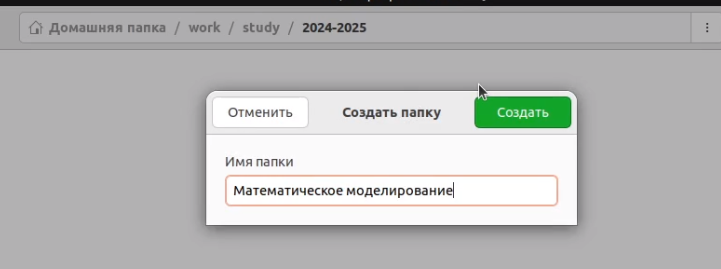
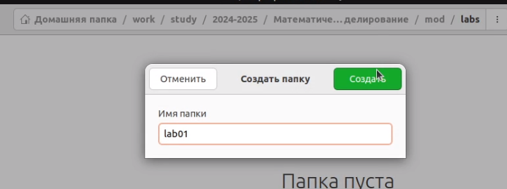
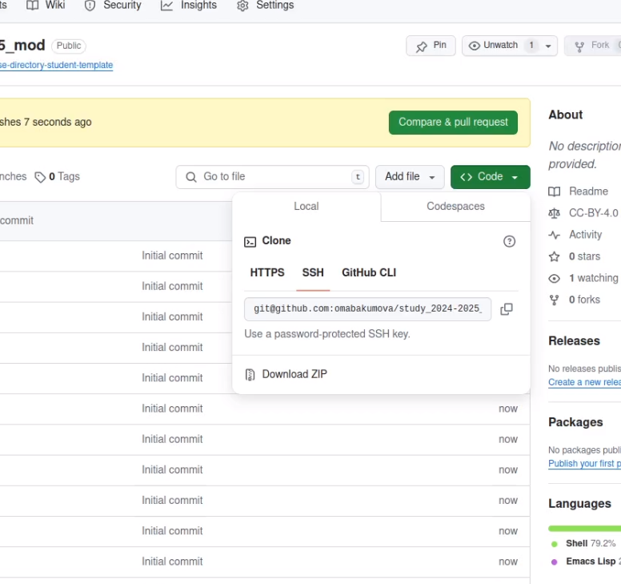
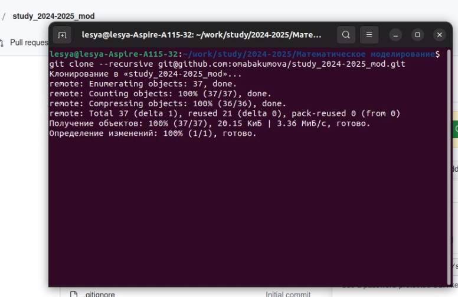
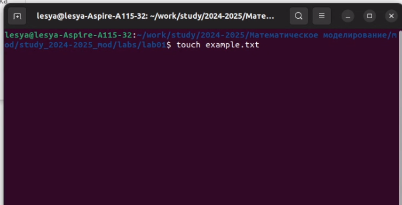
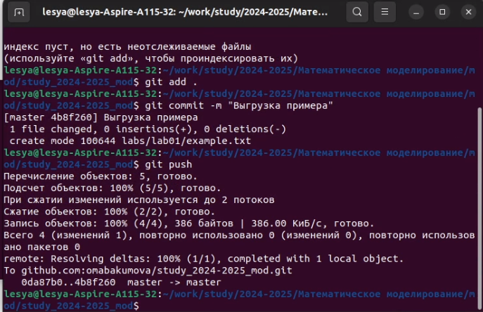
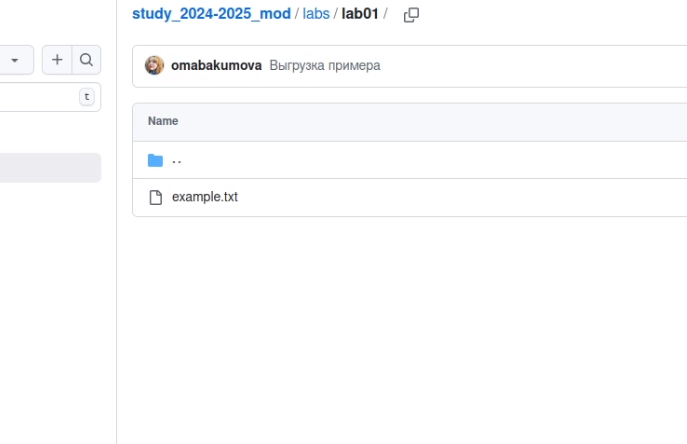

---
## Front matter
title: "Лабораторная работа 1. Подготовка рабочего пространства посредством Github"
author: "Абакумова Олеся Максимовна, НФИбд-02-22"

## Generic otions
lang: ru-RU
toc-title: "Содержание"

## Bibliography
bibliography: bib/cite.bib
csl: pandoc/csl/gost-r-7-0-5-2008-numeric.csl

## Pdf output format
toc: true # Table of contents
toc-depth: 2
lof: true # List of figures
lot: true # List of tables
fontsize: 12pt
linestretch: 1.5
papersize: a4
documentclass: scrreprt
## I18n polyglossia
polyglossia-lang:
  name: russian
  options:
	- spelling=modern
	- babelshorthands=true
polyglossia-otherlangs:
  name: english
## I18n babel
babel-lang: russian
babel-otherlangs: english
## Fonts
mainfont: IBM Plex Serif
romanfont: IBM Plex Serif
sansfont: IBM Plex Sans
monofont: IBM Plex Mono
mathfont: STIX Two Math
mainfontoptions: Ligatures=Common,Ligatures=TeX,Scale=0.94
romanfontoptions: Ligatures=Common,Ligatures=TeX,Scale=0.94
sansfontoptions: Ligatures=Common,Ligatures=TeX,Scale=MatchLowercase,Scale=0.94
monofontoptions: Scale=MatchLowercase,Scale=0.94,FakeStretch=0.9
mathfontoptions:
## Biblatex
biblatex: true
biblio-style: "gost-numeric"
biblatexoptions:
  - parentracker=true
  - backend=biber
  - hyperref=auto
  - language=auto
  - autolang=other*
  - citestyle=gost-numeric
## Pandoc-crossref LaTeX customization
figureTitle: "Рис."
tableTitle: "Таблица"
listingTitle: "Листинг"
lofTitle: "Список иллюстраций"
lotTitle: "Список таблиц"
lolTitle: "Листинги"
## Misc options
indent: true
header-includes:
  - \usepackage{indentfirst}
  - \usepackage{float} # keep figures where there are in the text
  - \floatplacement{figure}{H} # keep figures where there are in the text
---

# Цель работы

Подготовить рабочее пространство для публикации псоледующих лабораторных работ по дисциплине.

# Теоретическое введение

Система контроля версий Git представляет собой набор программ команд-
ной строки. Доступ к ним можно получить из терминала посредством ввода
команды git с различными опциями.
Благодаря тому, что Git является распределённой системой контроля версий,
резервную копию локального хранилища можно сделать простым копировани-
ем или архивацией.

# Выполнение лабораторной работы
## Подготовка рабочего пространства

Для начала создадим в рабочем каталоге новый каталог с названием дисциплины (рис. [-@fig:001]):

{#fig:001 width=70%}

В каталоге должна присутствовать многоступенчатая последовательность каталогов последними из которых являются нумерованные папки лабораторных работ (рис. [-@fig:002]):

{#fig:002 width=70%}

Далее нам необходим репозиторий Дмитрия Сергеевича для того, чтобы взять его шаблон за основу нашего будущего репозитория (рис. [-@fig:003]):

{#fig:003 width=70%}

Совершаем первоначальную настройку репозитория,именуя его в соответствии с курсом и делая его публичным (рис. [-@fig:004]):

{#fig:004 width=70%}

Репозиторий создан!Далее нам необходим **SSH key** нашего репозитория, который можно найти во вкладке **Code** (рис. [-@fig:005]):

{#fig:005 width=70%}

Теперь клонируем наш репозиторий в рабочем каталоге с помощью скопированного ключа, чтобы можно было туда выгружать наши работы (рис. [-@fig:006]):

{#fig:006 width=70%}

Попробуем что-то туда выгрузить.Для начала создадим в рабочем каталоге пустой файл,например,example.txt (рис. [-@fig:007]):

{#fig:007 width=70%}

Выгрузим все новые материалы из нашего рабочего каталога в репощиторий с помощью трех простых команд (рис. [-@fig:008]):

{#fig:008 width=70%}

Наш файл успешно выгружен в репозиторий!(рис. [-@fig:009]):

{#fig:009 width=70%}

# Выводы

Во время выполнения данной лабораторной работы я освежила в памяти, как пользоваться Github.

