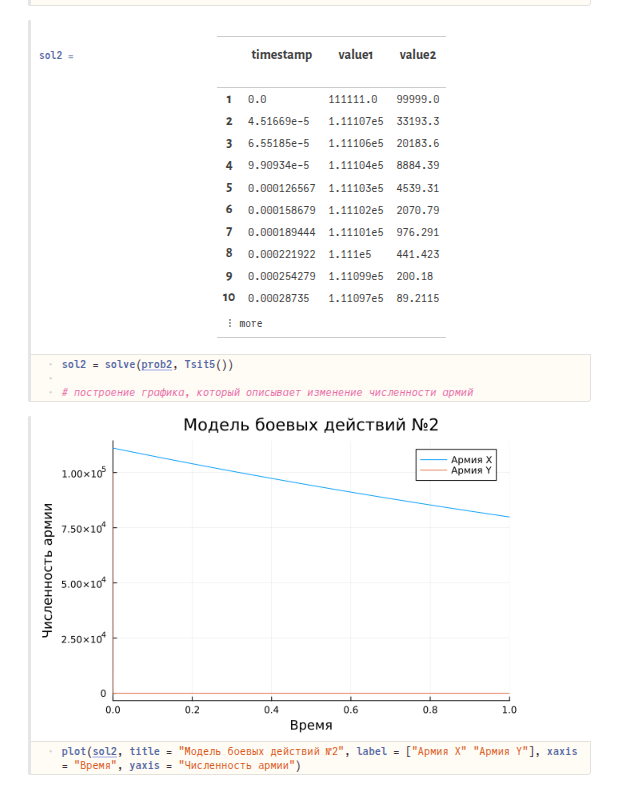
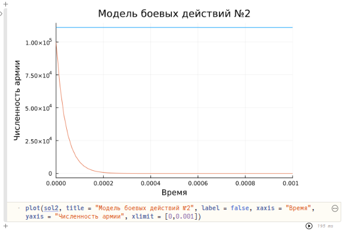
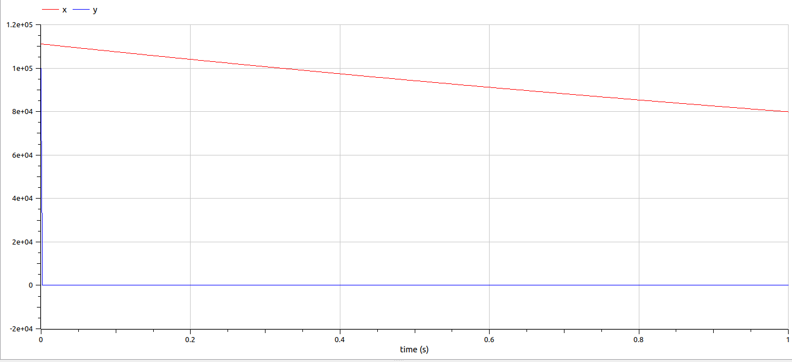

---
## Front matter
lang: ru-RU
title: Лабораторная работа №3
subtitle: Модель боевых действий
author:
  - Абакумова О.М, НФИбд-02-22
institute:
  - Российский университет дружбы народов, Москва, Россия

## i18n babel
babel-lang: russian
babel-otherlangs: english

## Formatting pdf
toc: false
toc-title: Содержание
slide_level: 2
aspectratio: 169
section-titles: true
theme: metropolis
header-includes:
 - \metroset{progressbar=frametitle,sectionpage=progressbar,numbering=fraction}
mainfont: Open Sans Light
---


# Информация

## Докладчик

:::::::::::::: {.columns align=center}
::: {.column width="70%"}

  * Абакумова Олеся Максимовна
  * Студентка
  * Российский университет дружбы народов
  * 1132220832@pfur.ru
  * <https://github.com/omabakumova>

:::
::: {.column width="30%"}


:::
::::::::::::::


## Цель работы

Построить модель боевых действий на языке прогаммирования Julia и посредством ПО OpenModelica.

## Задание

Построить графики изменения численности войск армии $X$ и армии $Y$ для  следующих случаев:

1. Модель боевых действий между регулярными войсками

2. Модель ведение боевых действий с участием регулярных войск и партизанских отрядов

# Выполнение лабораторной работы

## Модель боевых действий между регулярными войсками

$$\begin{cases}
    \dfrac{dx}{dt} = -0.33x(t)- 0.77y(t)+sin(t+11)\\
    \dfrac{dy}{dt} = -0.44x(t)- 0.66y(t)+cos(t+11)
\end{cases}$$

## Модель боевых действий между регулярными войсками

```Julia
function reg(u, p, t)
    x, y = u
    a, b, c, h = p
    dx = -a*x - b*y+sin(t+11)
    dy = -c*x -h*y+cos(t+11)
    return [dx, dy]
```
## Модель боевых действий между регулярными войсками

{#fig:001 width=25%}

## Модель боевых действий между регулярными войсками

```OpenModelica
model lab3
  parameter Real a = 0.33;
  parameter Real b = 0.77;
  parameter Real c = 0.44;
  parameter Real h = 0.66;
  parameter Real x0 = 111111;
  parameter Real y0 = 99999;
  Real x(start=x0);
  Real y(start=y0);
equation
    der(x) = -a*x - b*y+sin(time+11);
    der(y) = -c*x -h*y+cos(time+11);
end lab3;
```

## Модель боевых действий между регулярными войсками

{#fig:002 width=50%}

## Модель ведение боевых действий с участием регулярных войск и партизанских отрядов

$$\begin{cases}
    \dfrac{dx}{dt} = -0.33x(t)-0.77y(t)+sin(22t)\\
    \dfrac{dy}{dt} = -0.22x(t)y(t)-0.88y(t)+cos(22t)
\end{cases}$$

## Модель ведение боевых действий с участием регулярных войск и партизанских отрядов

```Julia

function reg_part(u, p, t)
    x, y = u
    a, b, c, h = p
    dx = -a*x - b*y+sin(22*t)
    dy = -c*x*y -h*y+cos(22*t)
    return [dx, dy]
```
## Модель ведение боевых действий с участием регулярных войск и партизанских отрядов

{#fig:003 width=25%}

## Модель ведение боевых действий с участием регулярных войск и партизанских отрядов

```Julia

plot(sol2, title = "Модель боевых действий №2", label = false, xaxis = "Время", 
yaxis = "Численность армии", xlimit = [0,0.001])

```
## Модель ведение боевых действий с участием регулярных войск и партизанских отрядов

{#fig:004 width=50%}

## Модель ведение боевых действий с участием регулярных войск и партизанских отрядов

```
model lab3
  parameter Real a = 0.33;
  parameter Real b = 0.77;
  parameter Real c = 0.22;
  parameter Real h = 0.88;
  parameter Real x0 = 111111;
  parameter Real y0 = 99999;
  Real x(start=x0);
  Real y(start=y0);
equation
    der(x) = -a*x - b*y+sin(22*time);
    der(y) = -c*x*y -h*y+cos(22*time);
end lab3;
```

## Модель ведение боевых действий с участием регулярных войск и партизанских отрядов

{#fig:005 width=50%}

## Модель ведение боевых действий с участием регулярных войск и партизанских отрядов

{#fig:006 width=50%}

# Выводы

В процессе выполнения данной лабораторной работы я построила модель боевых действий на языке прогаммирования Julia и посредством  OpenModelica.

