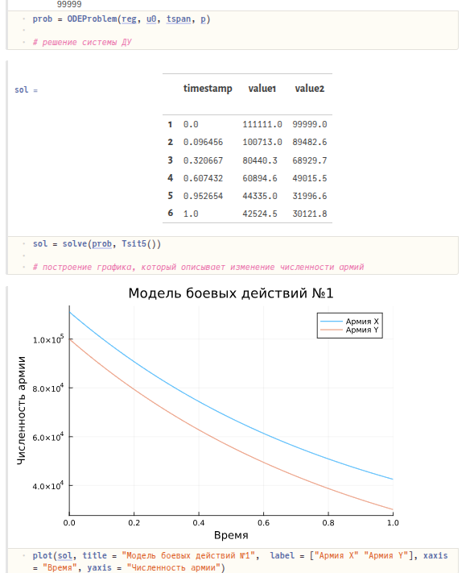
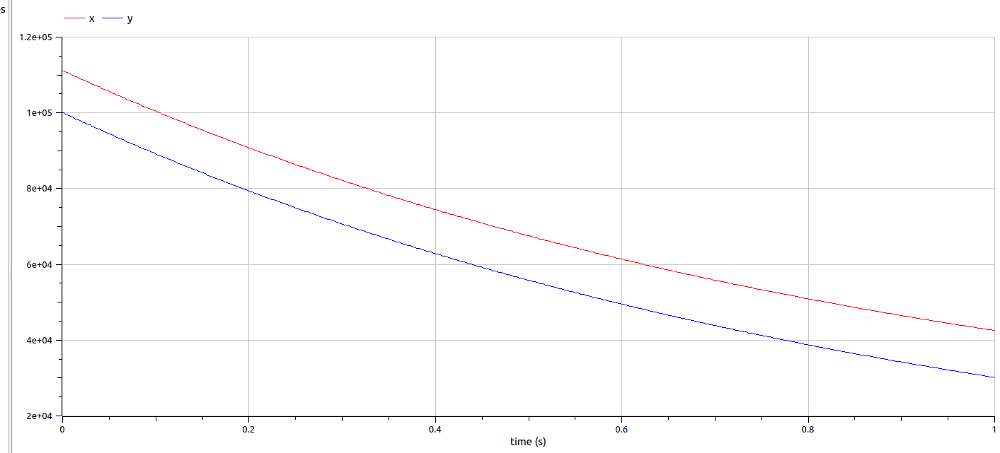
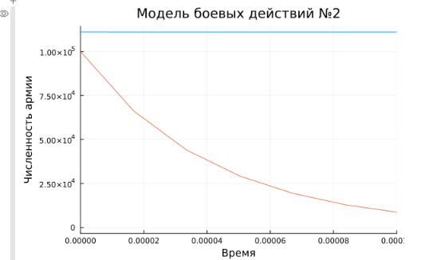

---
## Front matter
title: "Лабораторная работа №3"
subtitle: "Модель боевых действий"
author: "Абакумова О.М, НФИбд-02-22"

## Generic otions
lang: ru-RU
toc-title: "Содержание"

## Bibliography
bibliography: bib/cite.bib
csl: pandoc/csl/gost-r-7-0-5-2008-numeric.csl

## Pdf output format
toc: true # Table of contents
toc-depth: 2
lof: true # List of figures
lot: true # List of tables
fontsize: 12pt
linestretch: 1.5
papersize: a4
documentclass: scrreprt
## I18n polyglossia
polyglossia-lang:
  name: russian
  options:
	- spelling=modern
	- babelshorthands=true
polyglossia-otherlangs:
  name: english
## I18n babel
babel-lang: russian
babel-otherlangs: english
## Fonts
mainfont: IBM Plex Serif
romanfont: IBM Plex Serif
sansfont: IBM Plex Sans
monofont: IBM Plex Mono
mathfont: STIX Two Math
mainfontoptions: Ligatures=Common,Ligatures=TeX,Scale=0.94
romanfontoptions: Ligatures=Common,Ligatures=TeX,Scale=0.94
sansfontoptions: Ligatures=Common,Ligatures=TeX,Scale=MatchLowercase,Scale=0.94
monofontoptions: Scale=MatchLowercase,Scale=0.94,FakeStretch=0.9
mathfontoptions:
## Biblatex
biblatex: true
biblio-style: "gost-numeric"
biblatexoptions:
  - parentracker=true
  - backend=biber
  - hyperref=auto
  - language=auto
  - autolang=other*
  - citestyle=gost-numeric
## Pandoc-crossref LaTeX customization
figureTitle: "Рис."
tableTitle: "Таблица"
listingTitle: "Листинг"
lofTitle: "Список иллюстраций"
lotTitle: "Список таблиц"
lolTitle: "Листинги"
## Misc options
indent: true
header-includes:
  - \usepackage{indentfirst}
  - \usepackage{float} # keep figures where there are in the text
  - \floatplacement{figure}{H} # keep figures where there are in the text
---

# Цель работы

Построить модель боевых действий на языке прогаммирования Julia и посредством ПО OpenModelica.

# Задание

Между страной $X$ и страной $Y$ идет война. Численность состава войск
исчисляется от начала войны, и являются временными функциями $x(t)$ и $y(t)$. В
начальный момент времени страна $X$ имеет армию численностью 111 111 человек,
а в распоряжении страны $Y$ армия численностью в 99 999 человек. Для упрощения
модели считаем, что коэффициенты $a, b, c, h$ постоянны. Также считаем $P(t)$ и $Q(t)$ непрерывные функции.

Построить графики изменения численности войск армии $X$ и армии $Y$ для  следующих случаев:

1. Модель боевых действий между регулярными войсками
$$\begin{cases}
    \dfrac{dx}{dt} = -0.33x(t)- 0.77y(t)+sin(t+11)\\
    \dfrac{dy}{dt} = -0.44x(t)- 0.66y(t)+cos(t+11)
\end{cases}$$

2. Модель ведение боевых действий с участием регулярных войск и партизанских отрядов

$$\begin{cases}
    \dfrac{dx}{dt} = -0.33x(t)-0.77y(t)+sin(22t)\\
    \dfrac{dy}{dt} = -0.22x(t)y(t)-0.88y(t)+cos(22t)
\end{cases}$$

# Теоретическое введение

Законы Ланчестера (законы Осипова — Ланчестера) — математическая формула для расчета относительных сил пары сражающихся сторон — подразделений вооруженных сил. В статье «Влияние численности сражающихся сторон на их потери», опубликованной журналом «Военный сборник» в 1915 году, генерал-майор Корпуса военных топографов М. П. Осипов описал математическую модель глобального вооружённого противостояния, практически применяемую в военном деле при описании убыли сражающихся сторон с течением времени и, входящую в математическую теорию исследования операций, на год опередив английского математика Ф. У. Ланчестера. Мировая война, две революции в России не позволили новой власти заявить в установленном в научной среде порядке об открытии царского офицера.

Уравнения Ланчестера — это дифференциальные уравнения, описывающие зависимость между силами сражающихся сторон A и D как функцию от времени, причем функция зависит только от A и D.

# Выполнение лабораторной работы

## Модель боевых действий между регулярными войсками

$$\begin{cases}
    \dfrac{dx}{dt} = -0.33x(t)- 0.77y(t)+sin(t+11)\\
    \dfrac{dy}{dt} = -0.44x(t)- 0.66y(t)+cos(t+11)
\end{cases}$$

Потери, не связанные с боевыми действиями, описывают члены $-0.33x(t)$ и $-0.66y(t)$ (коэффиценты при $x$ и $y$ - это величины, характеризующие степень влияния различных факторов на потери), члены $-0.77y(t)$ и $-0.44x(t)$ отражают потери на поле боя (коэффиценты при  $x$ и $y$ указывают на эффективность боевых действий со стороны у и х соответственно). Функции P(t) = sin(t+11), Q(t) = cos(t+11) учитывают
возможность подхода подкрепления к войскам Х и У в течение одного дня.

Для начала построим эту модель на Julia:


```Julia

# используемые библиотеки
using DifferentialEquations, Plots;

# задание системы дифференциальных уравнений, описывающих модель 
# боевых действий между регулярными войсками

function reg(u, p, t)
    x, y = u
    a, b, c, h = p
    dx = -a*x - b*y+sin(t+11)
    dy = -c*x -h*y+cos(t+11)
    return [dx, dy]
end

# начальные условия

u0 = [111111, 99999]

p = [0.33, 0.77, 0.22, 0.66]

tspan = (0,1)

# постановка проблемы

prob = ODEProblem(reg, u0, tspan, p)

# решение системы ДУ

sol = solve(prob, Tsit5())

# построение графика, который описывает изменение численности армий

plot(sol, title = "Модель боевых действий №1",  label = ["Армия X" "Армия Y"], xaxis = "Время", yaxis = "Численность армии")
```

В результате получаем следующий график (рис. [-@fig:001]):

{#fig:001 width=70%}


Теперь давайте построим эту же модель посредством OpenModelica.

Здесь модель строить еще проще. Мы просто задаем параметры, начальные условия, определяем систему уравнений и просим программу выполнить симуляцию этой модели.

```OpenModelica
model lab3
  parameter Real a = 0.33;
  parameter Real b = 0.77;
  parameter Real c = 0.44;
  parameter Real h = 0.66;
  parameter Real x0 = 111111;
  parameter Real y0 = 99999;
  Real x(start=x0);
  Real y(start=y0);
equation
    der(x) = -a*x - b*y+sin(time+11);
    der(y) = -c*x -h*y+cos(time+11);
end lab3;
```

В результате получаем слудющий график изменения численности армий (рис. [-@fig:002]):

{#fig:002 width=70%}

## Модель ведение боевых действий с участием регулярных войск и партизанских отрядов

Во втором случае в борьбу добавляются партизанские отряды. Нерегулярные
войска в отличии от постоянной армии менее уязвимы, так как действуют скрытно,
в этом случае сопернику приходится действовать неизбирательно, по площадям,
занимаемым партизанами. Поэтому считается, что тем потерь партизан,
проводящих свои операции в разных местах на некоторой известной территории,
пропорционален не только численности армейских соединений, но и численности
самих партизан. В результате модель принимает вид:

$$\begin{cases}
    \dfrac{dx}{dt} = -0.33x(t)-0.77y(t)+sin(22t)\\
    \dfrac{dy}{dt} = -0.22x(t)y(t)-0.88y(t)+cos(22t)
\end{cases}$$

В этой системе все величины имею тот же смысл, что и в первой модели.

Построим модель на Julia:

```Julia

# задание системы дифференциальных уравнений, описывающих модель 
# боевых действий с участием регулярных войск и партизанских отрядов
function reg_part(u, p, t)
    x, y = u
    a, b, c, h = p
    dx = -a*x - b*y+sin(22*t)
    dy = -c*x*y -h*y+cos(22*t)
    return [dx, dy]
end

# начальные условия

# начальные условия
u0 = [111111, 99999]
p = [0.33, 0.77, 0.22, 0.88]
tspan = (0,1)

# постановка проблемы
prob2 = ODEProblem(reg_part, u0, tspan, p)

# решение системы ДУ
sol2 = solve(prob2, Tsit5())

# построение графика, который описывает изменение численности армий
plot(sol2, title = "Модель боевых действий №2", label = ["Армия X" "Армия Y"], xaxis = "Время", yaxis = "Численность армии")
```

В результате получаем слудющий график изменения численности армий (рис. [-@fig:003]):

{#fig:003 width=70%}

На данном графике сложно отследить, как происходило уменьшение численности армии Y, поэтому давайте возьмем временной интервал поменьше, чтобы было более наглядно, как умирает армия Y (рис. [-@fig:004]):

```Julia
plot(sol2, title = "Модель боевых действий №2", label = false, xaxis = "Время", yaxis = "Численность армии", xlimit = [0,0.001])
```

{#fig:004 width=70%}

Теперь выполним построение второй модели в Open Modelica. Код выглядит следующим образом:

```
model lab3
  parameter Real a = 0.33;
  parameter Real b = 0.77;
  parameter Real c = 0.22;
  parameter Real h = 0.88;
  parameter Real x0 = 111111;
  parameter Real y0 = 99999;
  Real x(start=x0);
  Real y(start=y0);
equation
    der(x) = -a*x - b*y+sin(22*time);
    der(y) = -c*x*y -h*y+cos(22*time);
end lab3;
```

В результате получается такой график:

{#fig:005 width=70%}

Давайте так же, как мы делали в Julia, уменьшим интервал, чтобы посмотреть поближе уменьшение численности армии Y.

{#fig:006 width=70%}

На графике теперь видно, как происходит вымирание людей в армии Y. За этот  интервал армия X даже не успела сократиться в своей численности.

Сравнивая графики, полученные в Julia и OpenModelica, разницы особой незаметно. Если сильно вглядываться, можно заметить, что в OpenModelica график чуть более плавный и точный.

# Выводы

В процессе выполнения данной лабораторной работы я построила модель боевых действий на языке прогаммирования Julia и посредством  OpenModelica.


